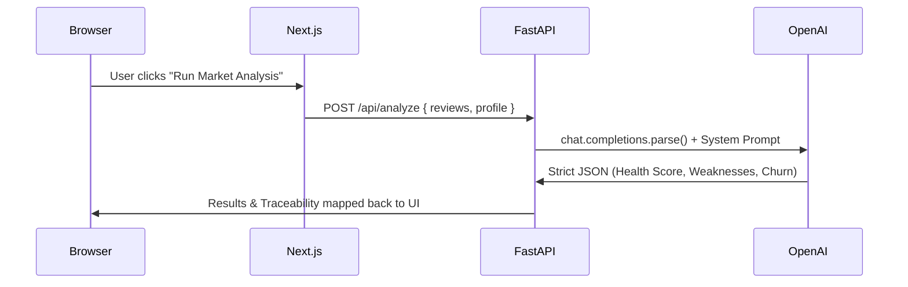

# Competitor Weakness Miner

> **Boundary AI Hackathon Project**
> An autonomous, multi-agent market intelligence pipeline that turns noisy competitor reviews into actionable, offensive sales strategy.

---

## 🎯 The Vision: Defensive vs. Offensive Intelligence
Boundary AI answers the question: *"What do our own customers think of us?"* 
**Competitor Weakness Miner** answers the question: *"What do our competitor's customers hate about them, and how do we steal them?"*

We've built an **offensive sales intelligence weapon** that ingests messy, bilingual (EN/FR) public reviews of a competitor (e.g., OmniDesk), reads the noise, and outputs traceable weaknesses, churn lead signals, and fully-written Jira engineering tickets for your product team to build the exact features needed to win their users.

## ✨ Key Features

1. **Agentic Pipeline (GPT-4o-mini)**
   - Leverages OpenAI Structured Outputs and Pydantic schemas to guarantee strict, traceable JSON intelligence. No hallucinations.
2. **"Living Intelligence" Dashboard**
   - **Competitor Health Score:** A 0–100 gauge showing how vulnerable the competitor is right now.
   - **Hot Churn Urgency Flags:** Reads emotional intent and highlights users who are actively switching platforms as hot sales leads.
   - **Personalized Solution Pitches:** Scrapes your own company profile (e.g., Boundary AI) to write tailored competitive advantage pitches against the competitor.
3. **Absolute Traceability**
   - Eliminates "black-box" AI. Every identified weakness highlights and cites the exact raw reviews (with `review_id`s) that prove the weakness exists in real time.
4. **Bilingual Enterprise Ready**
   - Out of the box support for analyzing English and Quebec French mixed semantics.

---

## 🏗️ Architecture

- **Backend:** FastAPI (Python), OpenAI API, Pydantic, CORS
- **Frontend:** Next.js 16 (React, App Router, Tailwind v4, TypeScript)
- **Data:** Scraped bilingual review JSON payload



---

## 🚀 Getting Started

To run this full-stack application locally, you'll need two terminal windows.

### 1. Backend Setup (FastAPI)

Navigate to the backend directory and set up your Python environment:

```bash
cd backend
python -m venv venv

# Windows
.\venv\Scripts\activate
# macOS / Linux
source venv/bin/activate

pip install -r requirements.txt
```

Create a `.env` file in the `backend/` directory and add your OpenAI API key:
```env
OPENAI_API_KEY=sk-proj-your-api-key-here
```

Start the robust Uvicorn server:
```bash
python -m uvicorn main:app --host 0.0.0.0 --port 8000 --reload
```

### 2. Frontend Setup (Next.js)

Navigate to the frontend directory and install dependencies:

```bash
cd frontend
npm install

# Start the Next.js development server
npm run dev
```

The Next.js dashboard will be available at [http://localhost:3000](http://localhost:3000).

---

## 🛠️ Usage

1. Open `http://localhost:3000`.
2. Inspect the **Company Profile** on the left. It comes pre-filled with Boundary AI's real value proposition and target market.
3. Review the raw, noisy OmniDesk competitor reviews on the right panel.
4. Click **🚀 Run Agentic Market Analysis**.
5. Watch the pipeline ingest the reviews, classify churn intents, calculate a health score, and generate actionable Jira tickets with highlighted trace evidence.

---

**Built for the Boundary AI Hackathon.**
